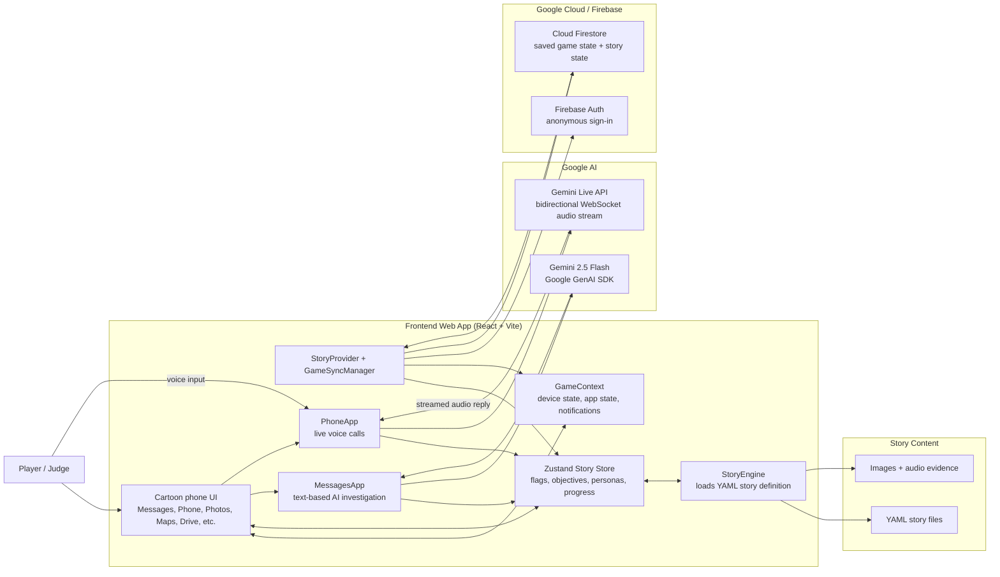

# Architecture Diagram

This diagram reflects the current repo architecture for the "Finding Maya" interactive investigation app.

## What Judges Should Notice

- The app runs as a React/Vite web client styled as a phone operating system for interactive investigation gameplay.
- Gemini 2.5 Flash powers dynamic text conversations and objective evaluation inside the story loop.
- Gemini Live API powers real-time, interruptible voice calls using microphone input and streamed audio output.
- Firebase Auth and Cloud Firestore provide Google Cloud-backed identity and persistence for each player's progress.
- Local YAML story files and bundled media assets define the mystery content, clues, and event triggers.

## Short Submission Caption

The frontend is a React/Vite mobile-style investigation interface that loads structured story content from YAML files and media assets. Gemini 2.5 Flash drives text conversations and story-objective checks, while Gemini Live API powers real-time voice calls with streamed audio. Firebase Auth and Cloud Firestore on Google Cloud persist each player's game and story state across sessions.
