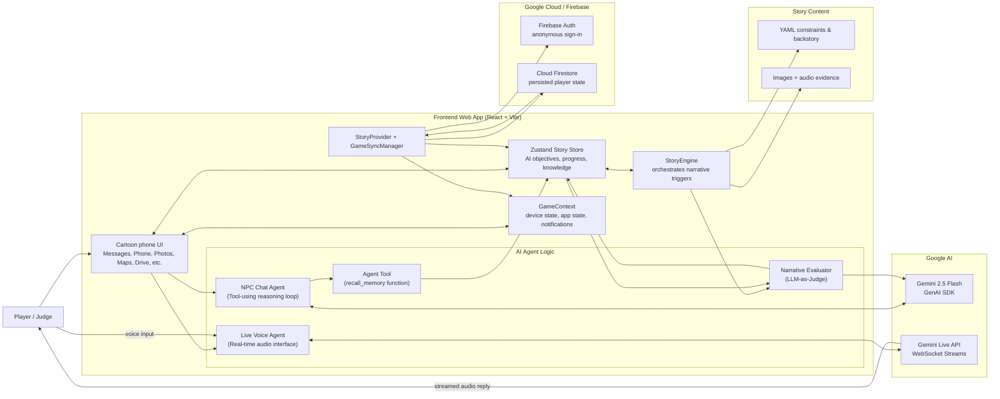

# Architecture Diagram

This diagram reflects the current repo architecture for the "Finding Maya" interactive investigation app.

## What Judges Should Notice

- **Agentic NPC Logic:** Characters use a plan-act-observe loop powered by Gemini 2.5 Flash, allowing them to autonomously use tools like `recall_memory` to dynamically reveal clues.
- **LLM-as-Judge Evaluator:** A background narrative evaluator silently monitors conversations to determine when players have met custom objectives, unlocking new content dynamically.
- **Multimodal Real-Time Agents:** Uses the Gemini Live API to power real-time, interruptible conversational voice agents simulating live investigations.
- **State-Driven Story Engine:** The frontend (React/Vite) dynamically renders a phone OS investigation interface while Firebase Auth and Cloud Firestore persist progress.
- **Declarative Narrative Constraints:** Story content, personas, and behavioral constraints are loaded from local YAML files and injected directly into the agents' context windows.

## Short Submission Caption

The frontend is a React/Vite mobile-style investigation interface that acts as the client for multiple specialized AI agents. NPC text conversations are driven by a tool-using Agent Loop powered by Gemini 2.5 Flash, while voice calls use the Gemini Live API for real-time streaming interactions. A background LLM-as-Judge continuously evaluates player progress against YAML-defined objectives to progress the story. Firebase Auth and Cloud Firestore on Google Cloud persist each player's state across sessions.
